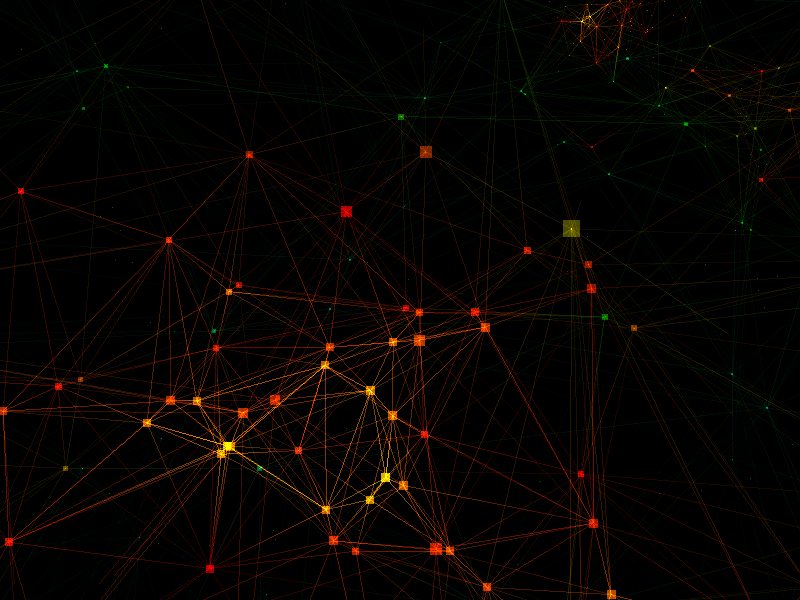
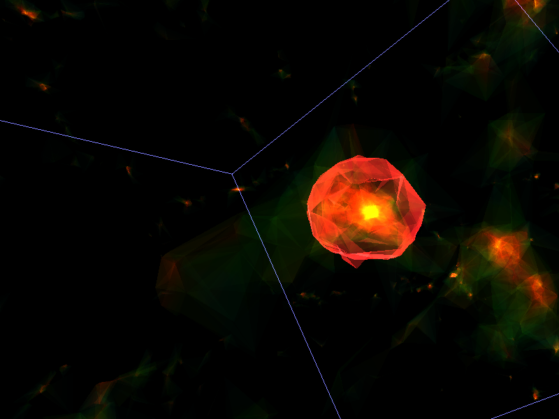
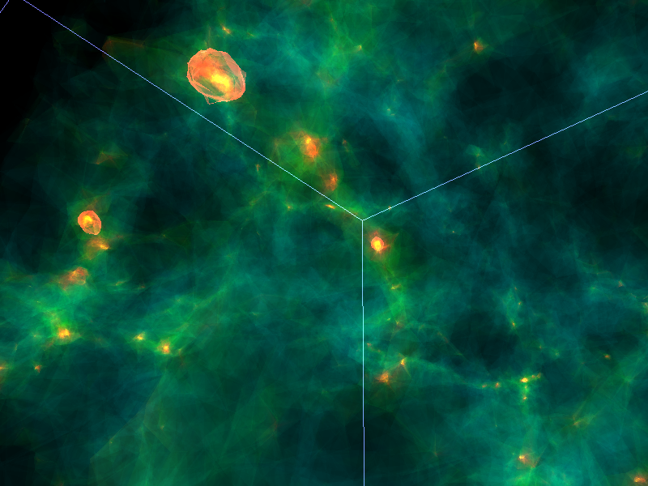
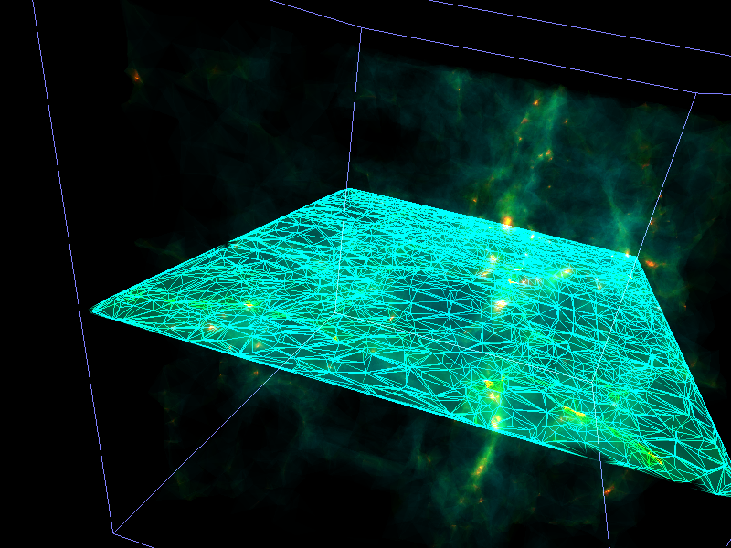
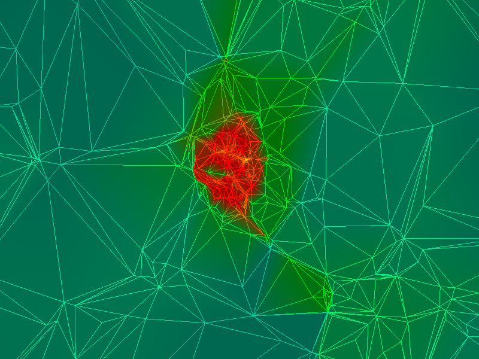

# Delaunay volume rendering

## Description

This is a volume rendering code that produces gorgeous visualizations at interactive rates. Since it is based on a tessellation (in comparison to grid-based methods) there is no resolution limit and one can zoom in all the way to the smallest separation between particles. 

The technique us an approximation to actual volume rendering. It approximates the integrated of the scalar field signal along the line of sight (as in real volume rendering) for a simple triangle rendering of the Delaunay tessellation. So the continuous field is approximated by a series of delta functions (intersection with triangles) scaled with the density field at that location. For visualiation purposes the approximation is indistinguishable from a full volume rendering at a much lower computational cost.

The code is quite long and full of patches/bugs/cheap tricks. This is a research code that I use to do some data exploration visualizing simlated galaxies to find interesting features/events to study further.

## Data files

At the moment the code need the point distribution (file.CGAL), the density field values at each point (file.den) and the tessellation consisting of the connections between points (file.TETRA). The file structure is straightforward, see the code for details.

## Renderings

The following are some screen grabs from interactive visualizations:

Visualizing a sparsely sampled dark matter halo. Notice how few particles there are and how the Delaunay tesselation fills the gaps between particles:

This is the resulting density field

We can compute isodensity contours directly on the Delaunay tessellation:

Here another view of isodensity contours on top of the density field.

We can also cut a plane across the tessellation:

and visualize the plane in 2D. Here showing the core of a dark matter halo:

## Notes

The code compiles with OpenFrameworks v0.62. I suspect it must be ported to the new OF API. 

